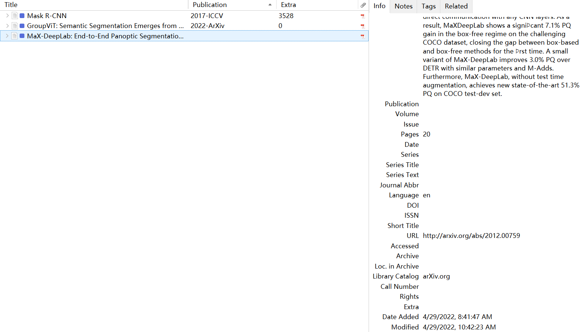
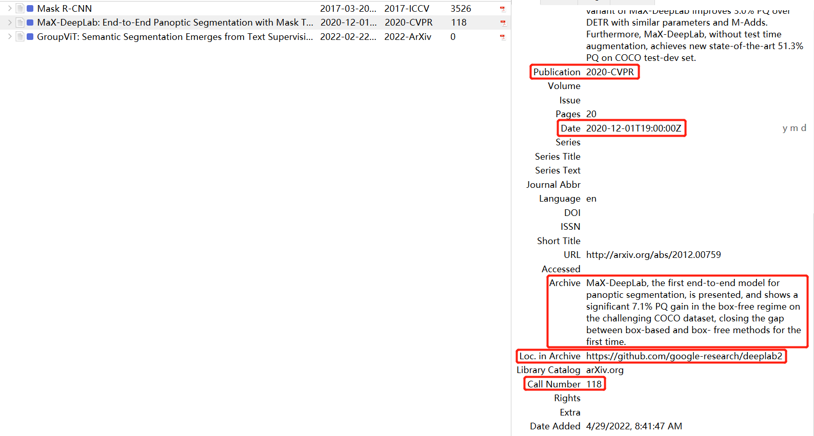
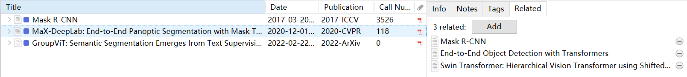
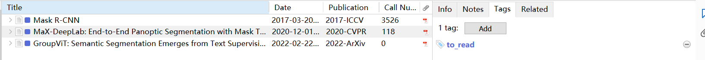

# Zotero-Literature-Manager
This is an add-on for Zotero, a research source management tool. This add-on can automatically retrieve citations, official code link, published year and conference, related papers, a automatically generated summary and so on for articles from ArXiv.

This add-on is modified from [zotero-citationcounts](https://github.com/eschnett/zotero-citationcounts).

## Installation

- Download the latest release
- Run Zotero (version 6.x)
- Go to `Tools -> Add-ons`
- `Install Add-on From File`
- Choose the downloaded file
- Restart Zotero

## Features

- Automatically add a "to_read" tag to new items
- Automatically retrieve literature data for papers (from ArXiv), including
  - citation counts
  - the date uploaded to ArXiv
  - official code link
  - published year and conference
  - a automatically generated summary
  - related papers

## Example

1. Import your paper into Zotero and it will be translated by Zotero. If the URL Field translated by Zotero is not ArXiv link, you have to modify it manually.

   

2. Then, this add-on will automatically retrieve more information for you. Certainly, you can do it manually, too.

   Some literature data:

   
   
   Related papers in your Zotero library:
   
   
   
   "to_read" tag for new items (you can assign color for "to_read" tag to filter unread papers conveniently):
   
   

## More about this add-on

- **Important!** You have to make sure that the paper is uploaded to ArXiv and the **URL Field** in Zotero must be the **ArXiv links** for this paper. Or you may modify the **URL Field** manually.

- **Important!** You have to make sure that the **Item Type Field** in Zotero is **"Journal Article"** or **"Conference Paper"**, because different type in Zotero has different fields.

- Which Field will record retrieved information? And where the information is retrieved from?

  | Retrieved information                                        | Field in Zotero                                              | Source                                               |
  | ------------------------------------------------------------ | ------------------------------------------------------------ | ---------------------------------------------------- |
  | citation counts                                              | Call Number                                                  | [Semantic Scholar](https://www.semanticscholar.org/) |
  | the date uploaded to ArXiv                                   | Date                                                         | [ArXiv](https://arxiv.org/)                          |
  | official code link                                           | Loc. in Archive                                              | [Paper With Code](https://paperswithcode.com/)       |
  | published year and conference                                | Publication (in journal article)  Proceedings Title (in conference paper) | [Semantic Scholar](https://www.semanticscholar.org/) |
  | a summary generated by [SciTLDR](https://github.com/allenai/scitldr) | Archive                                                      | [Semantic Scholar](https://www.semanticscholar.org/) |
  | related papers in your Zotero Library                        | Related                                                      | [Connected Papers](https://www.connectedpapers.com/) |
  
  The Field to record information may be changed in future releases, and customizing Field by user-self will be added too. Nevertheless, I'm suggesting you to choose one particular type for all of your papers no matter they come from journal or conference, because different type in Zotero has different fields and this may bring you some trouble to sort or filter by an field.

- This add-on will focus on papers from ArXiv as the developer of this add-on mainly reads papers from ArXiv. If your paper is not uploaded to ArXiv and you might be suggested to search for other add-on like [zotero-citationcounts](https://github.com/eschnett/zotero-citationcounts).

## Todo

- [ ] Custom Tag for new items
- [ ] Custom Field
- [ ] Custom Item Type Field
- [ ] Custom format to record retrieved information

## License

Distributed under the Mozilla Public License (MPL) Version 2.0.
