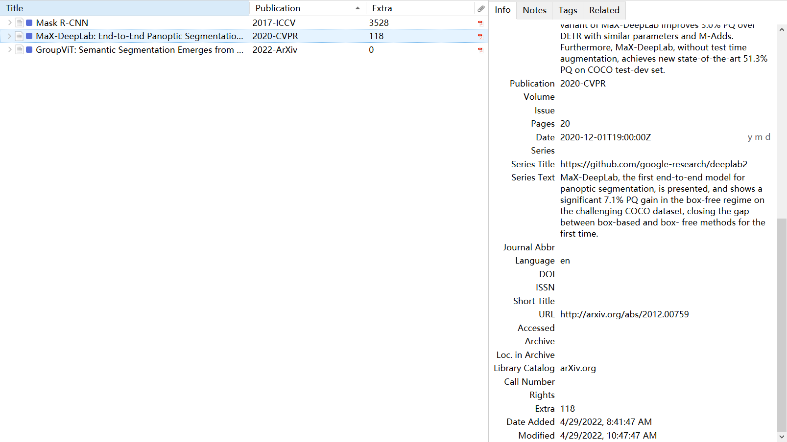

# Zotero-Literature-Manager
This is an add-on for Zotero, a research source management tool. This add-on can automatically retrieve citations, official code link, published year and conference, related papers, a automatically generated summary and so on for articles from ArXiv.

This add-on is modified from [zotero-citationcounts](https://github.com/eschnett/zotero-citationcounts).

## Install

- Download the latest release
- Run Zotero (version 6.x)
- Go to `Tools -> Add-ons`
- `Install Add-on From File`
- Choose the downloaded file
- Restart Zotero

## Example

1. Import your paper into Zotero and it will be translated by Zotero. If the URL Field translated by Zotero is not ArXiv link, you have to modify it manually.

   

2. Then, this add-on will automatically retrieve more information for you. Certainly, you can do it manually, too.

   

   

## More about this add-on

- **Important!** You have to make sure that the paper is uploaded to ArXiv and the **URL Field** in Zotero must be the **ArXiv links** for this paper. Or you can modify the **URL Field** manually.

- **Important!** You have to make sure that the **Item Type Field** in Zotero is **"Journal Article"**, because the conference paper type in Zotero have some different fields.

- Which Field will record retrieved information? And where the information is retrieved from?

  | Field in Zotero | Retrieved information                                        | Source                                               |
  | --------------- | ------------------------------------------------------------ | ---------------------------------------------------- |
  | Publication     | year-conference/journal                                      | [Semantic Scholar](https://www.semanticscholar.org/) |
  | Date            | the date uploaded to ArXiv                                   | [ArXiv](https://arxiv.org/)                          |
  | Series Title    | the official code url                                        | [Paper With Code](https://paperswithcode.com/)       |
  | Series Text     | a summary generated by [SciTLDR](https://github.com/allenai/scitldr) | [Semantic Scholar](https://www.semanticscholar.org/) |
  | Extra           | citation counts                                              | [Semantic Scholar](https://www.semanticscholar.org/) |
  | Related         | related papers in your Zotero Library                        | [Connected Papers](https://www.connectedpapers.com/) |

  The Field to record information may be changed in future releases, and customizing Field by user-self will be added too.

- This add-on will focus on papers from ArXiv as the developer of this add-on mainly reads papers from ArXiv. If your paper is not uploaded to ArXiv and you might be suggested to search for other add-on like [zotero-citationcounts](https://github.com/eschnett/zotero-citationcounts).

## Todo

- [ ] Custom Field
- [ ] Custom Item Type Field
- [ ] Custom format to record retrieved information

## License

Distributed under the Mozilla Public License (MPL) Version 2.0.
